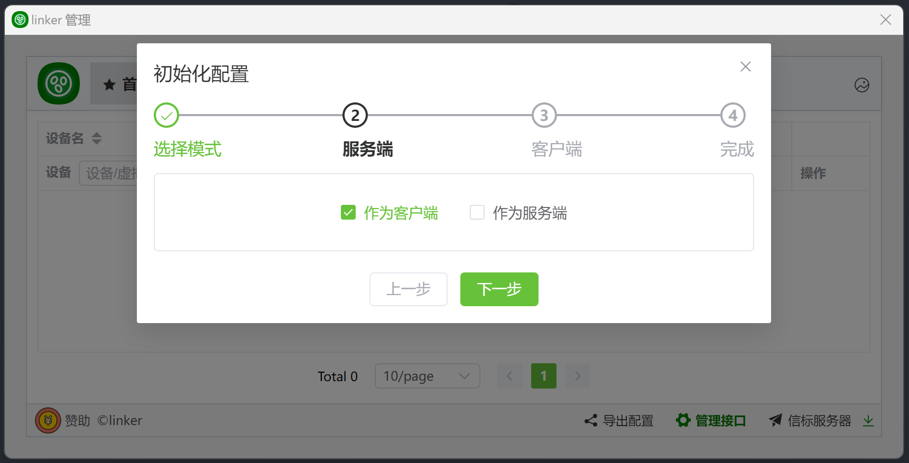

# 2.3、初始化配置

## 1、公共配置文件，客户端服务端都有的

:::tip[服务端运行流程]
```
{
  //运行在哪个模式下，多个模式可同时存在
  "Modes": [ "client","server"],
  //是否已初始化安装
  "Install": true,
  //日志级别 0 debug 1 info 2 warn 3 error 4 fatal
  "LoggerType": 0,
  //这个不管
  "LoggerSize": 100,
  //加密证书，包括信标服务器，中继，打洞，都用这个证书
  "SSL": {
    "File": "./snltty.pfx",
    "Password": "oeq9tw1o"
  },
  //程序更新地址
  "UpdateUrl": "https://static.qbcode.cn/downloads/linker",
  //检查更新间隔，单位秒
  "UpdateIntervalSeconds": 60,
  //是否检查更新
  "CheckUpdate": true
}
```
:::

## 2、服务端手动修改配置文件

:::tip[服务端运行流程]
1. 运行程序，在configs目录下会生成 common.json server.json
2. 关闭程序
3. 修改common.json，Modes 只保留 server
4. 修改server.json，可以去在线生成一些GUID作为各个功能的密钥
5. 再次运行程序


common.json
```
{
  "Modes": ["server"]
}
```
server.json
```
{
  //中继
  "Relay": {
    //中继密钥，客户端密钥不准确时无法使用本中继
    "SecretKey": ""
  },
  //信标服务器端口
  "ServicePort": 1802,
    
  //内网穿透配置
  "SForward": {
    //内网穿透密钥
    "SecretKey": "",
    "BufferSize": 3,
    //web端口，用于按域名穿透
    "WebPort": 0,
    //隧道端口范围，用于按端口穿透
    "TunnelPortRange": [
      10000,
      60000
    ]
  },
  //登入信标密钥，默认为空，即为所有客户端均可登入本信标服务器
  "SignIn": {
    "SecretKey": ""
  },
  //更新密钥，客户端密钥不正确时，只能更新自己本身
  "Updater": {
    "SecretKey": ""
  }
}
```
:::

## 3、客户端使用web初始化

:::tip[说明]
1. 运行程序后,浏览器打开<a href="http://127.0.0.1:1804" target="_blank">http://127.0.0.1:1804</a>
2. 如果你自己部署了服务端，你可以勾选**我有服务器**，填写你部署的服务端的各种信息




:::


