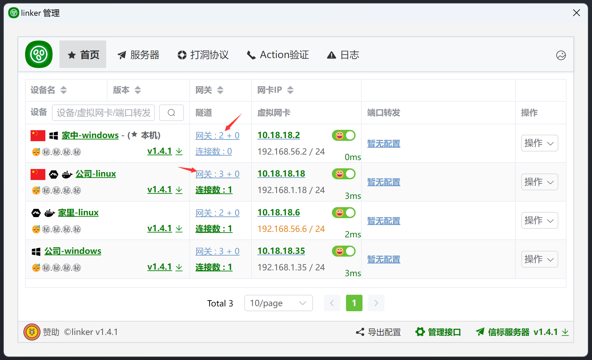

# 4.1、打洞

## 1、支持msquic

:::tip[说明]

1. 在windows，如果提示不支持msquic，可以到 <a target="_blank" href="https://github.com/microsoft/msquic/releases/latest">msquic</a> 下载合适你系统的版本，覆盖根目录下的msquic.dll，一般来说，win10或以下版本，需要openssl版本的msquic
2. 在linux ubuntu  debian，请按<a target="_blank" href="https://github.com/dotnet/runtime/tree/main/src/libraries/System.Net.Quic">官方说明</a>安装msquic
3. 在linux alpine，可以参照<a target="_blank" href="https://blog.snltty.com/2024/07/24/%e8%87%aa%e5%b7%b1%e7%bc%96%e8%af%91alpine%e4%b8%8b%e7%9a%84msquic/">编译alpine平台的msquic</a>自己编译msquic

:::

## 2、打洞协议调整

:::danger[说明]

1. 在 `配置`、`打洞协议`中，你可以做一些调整，调整协议使用顺序。或者是否禁用一些打洞协议
2. 在 `打洞排除IP`中，有些时候，你的设备上可能有很多虚拟网卡，你不希望这些IP参与打洞，就可以添加进去

:::

## 3、调整网关层级

:::danger[说明]

1. TCP打洞，UDP打洞大都依赖于网关层级，默认网关层级是自动计算的，你也可以手动指定网关层级，这很有可能有助于打洞
2. 如果你看到 `网关 : 1 + 0`，层级只有`1`，那大概率是你连接的服务器走了什么奇怪的线路，这会打洞失败

:::

