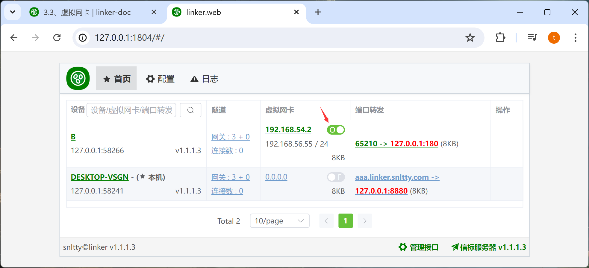

# 3.3、虚拟网卡

1. 此一项，可以为每个设备安装一个**虚拟网卡**，然后分配一个**IP**，通过IP地址访问设备。不受端口限制。
2. 两个设备之间通过**虚拟网卡**互相访问，则两个设备都需要安装虚拟网卡，且IP段一致，比如都是 **192.168.54.x/24**，一个是**192.168.54.2**，一个是**192.168.54.3**，而不能配置为**192.168.54.2**和**192.168.55.3**

3. 如果你无法开启虚拟网卡，可以到<a target="_blank" href="https://github.com/xjasonlyu/tun2socks/releases/latest">tun2socks</a> 下载对应你系统的版本，覆盖`plugins/tuntap/` 下的 `tun2socks` 或 `tun2socks.exe`

:::tip[局域网IP特别说明]

1. 假设你 A 的内网IP是 **192.168.1.2**，B 的内网IP是 **192.168.2.3**，这样AB之间是无法相互连接的
2. 这时 A 可以在 **局域网IP**填写 **192.168.1.2/24**，B 填写 **192.168.2.3/24**，这样AB之间就可以使用对方的内网IP相互访问
3. 值得一提的是，如果你选择填写**局域网IP**，那么每个客户端之间，是不能填写相同网段的**局域网IP**，会冲突

:::

:::danger[非常重要的一点]

1. 虚拟网卡IP请不要使用`255`，`255`会被认为是广播地址
2. 虚拟网卡UDP，支持广播组播，但是，当遇到**广播组播IP**时，不会去连接其它客户端(打洞或中继)，所以你应该事先使用别的通信使得客户端之间已建立连接
3. 当遇到**广播组播IP**时，为了不产生网络风暴，目标IP会被默认替换为 **127.0.0.1**，但是，如果你使用docker时配置了**SNLTTY_LINKER_HOST_IP**，则会被替换为你配置的IP，一般推荐配置为宿主机IP，请参考[安装](../2、首次运行/2.1、安装.md)

:::

## 1、配置虚拟网卡IP

在设备，虚拟网卡一栏，点击IP配置

1. 为目标设备设置一个IP地址，例如 **192.168.54.2**，每个客户端之间，填写相同网段的**网卡IP**，且掩码是**/24**的
2. `局域网IP` 是选填的，可以不填

:::tip[局域网IP特别说明]

1. 假设你 A 的内网IP是 **192.168.1.2**，B 的内网IP是 **192.168.2.3**，这样AB之间是无法相互连接的
2. 这时 A 可以在 **局域网IP**填写 **192.168.1.2/24**，B 填写 **192.168.2.3/24**，这样AB之间就可以使用对方的内网IP相互访问
3. 值得一提的是，如果你选择填写**局域网IP**，那么每个客户端之间，是不能填写相同网段的**局域网IP**，会冲突

:::

>

## 2、开启网卡

开启网卡成功后，即可通过**虚拟IP**访问目标设备

