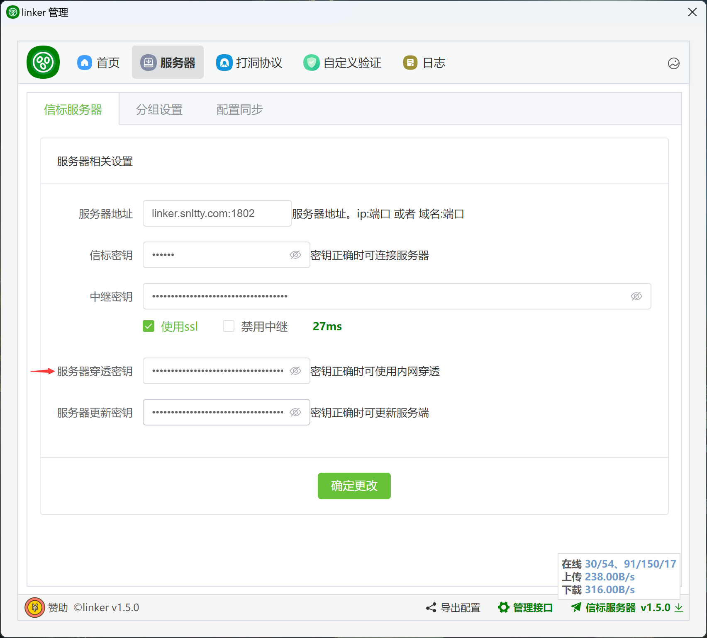
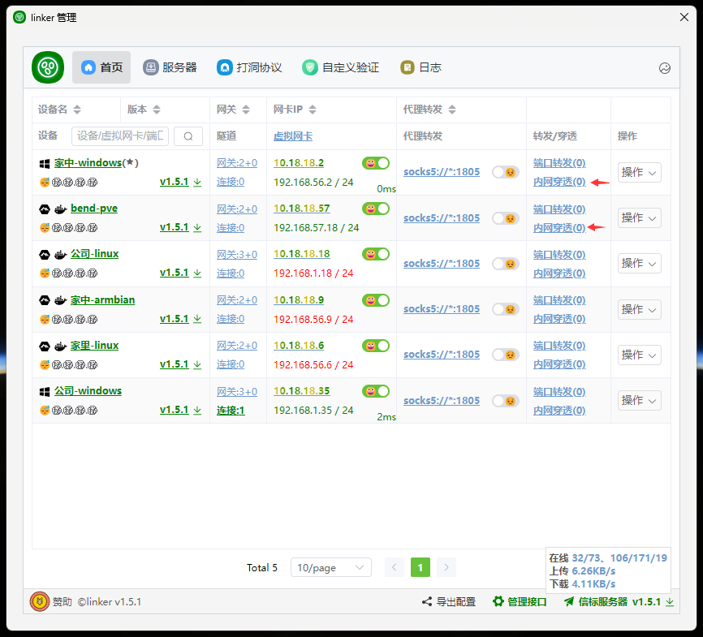

# 3.3、服务器代理穿透

:::tip[说明]

1. 这是一种将本地端口映射到公网的穿透方式，大概就是通过`服务器ip:端口`、`域名:端口`，访问你本机的服务
2. 这需要你自己部署服务端，`linker.snltty.com`是不支持的
3. 只在被访问端运行linker客户端，访问端不需要运行客户端
:::

## 1、配置穿透密钥
在服务端 configs/server.json 中，复制密钥，添加到客户端配置中

## 2、配置端口转发
在 **本机** 设备上，端口转发一栏

点击**添加**按钮，添加一项转发，未开启转发时，可以双击 **名称**、**远程域名/端口**、**本机服务**一栏进行修改

## 3、注意事项

:::danger[注意]
1. 如果你使用域名，则需要将域名解析到你的服务器，且，服务端需配置web端口
    1. 假设我端口转发 **远程端口/域名** 一栏，填写 **aaa.linker.snltty.com**，则需要将域名泛解析 ***.linker.snltty.com** 到服务器 
    2. 在本机服务一栏，填写 **127.0.0.1:8880**
    3. 服务端配置端口为 **12345**
    4. 在访问 **aaa.linker.snltty.com:12345** 时，能访问到本机的**127.0.0.1:8880**服务
2. 如果你使用端口，则，在服务器配置中，填写 **TunnelPortRange**，两项，分别为开始端口，结束端口，在此范围内端口可用于内网穿透，需要注意的是，在服务器运营商后台，需要开放这些端口
    1. 假设我端口转发 **远程端口/域名** 一栏，填写 **20480**，这时候
    2. 在本机服务一栏，填写 **127.0.0.1:8880**
    3. 在访问 **linker.snltty.com:20480** 时，能访问到本机的**127.0.0.1:8880**服务
:::

