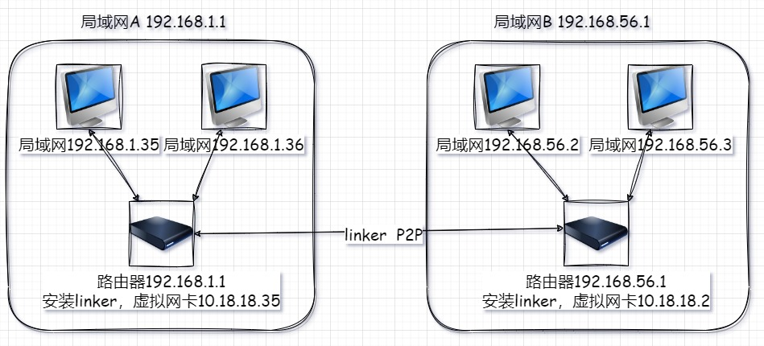
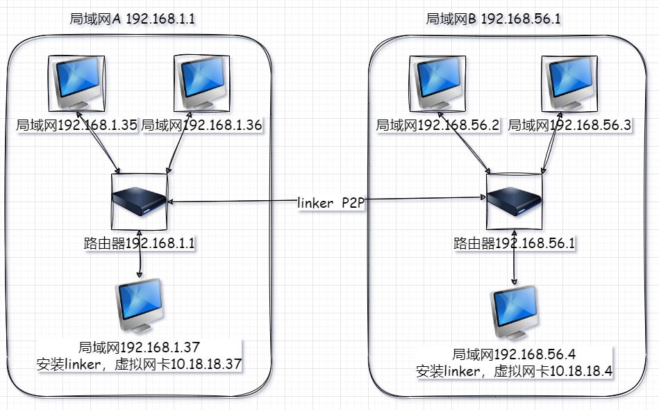

# 1.2、网对网

:::tip[在网关]

1. 如果你把linker安装在路由器上，则已经支持网对网
2. 两端局域网已经能互通，因为默认已经有 `0.0.0.0` 路由到路由器

:::

:::danger[不在网关]

#### 1、安装linker的设备
1. 如果你无法将linker安装在路由器上，那你可以将linker安装到局域网内其它设备都可以连接的其中一台设备上 
2. 安装linux的设备可以是`linux`、`windows`，但是`windows`需要支持`NetNat`，<a href="./1.1.1、NetNat">请参照 1.1.1、NetNat</a>
#### 2、局域网内其它设备

##### 1、手动添加路由
1. 局域网A 未安装linker的设备 添加路由，例如windows `route add 192.168.56.0 mask 255.255.255.0 192.168.1.37`
2. 局域网B 未安装linker的设备 添加路由，例如windows `route add 192.168.1.0 mask 255.255.255.0 192.168.56.4`
##### 2、自动添加路由
1. windows下可以使用 `linker.route.win.exe`工具在未安装linker的设备上运行，让它帮助你自动添加路由，跟管理页面一样填写接口地址和接口密钥即可

:::
